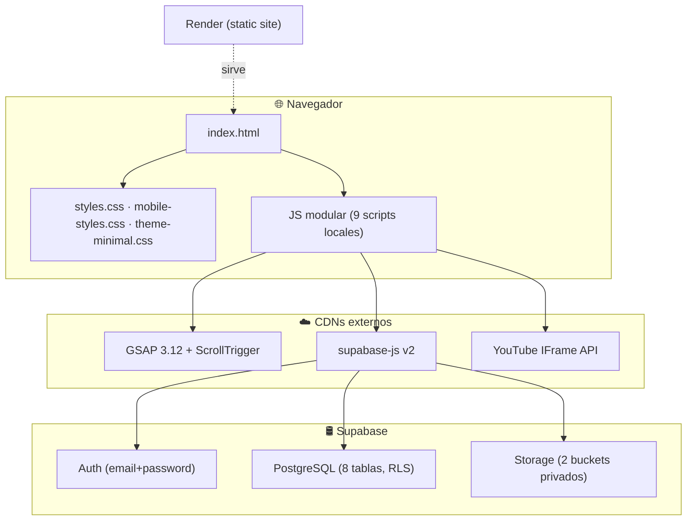
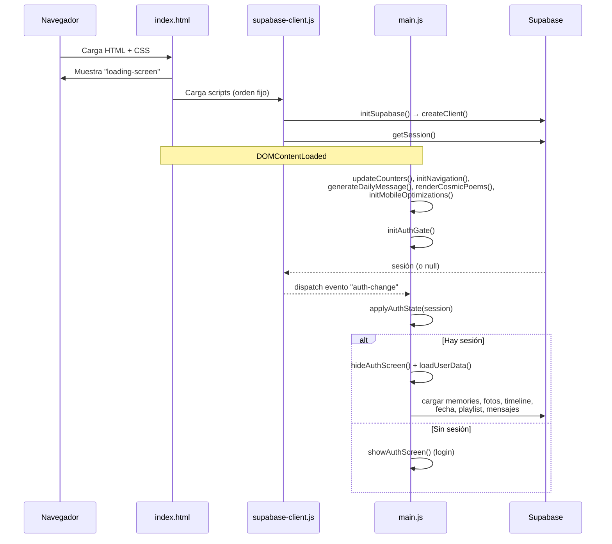
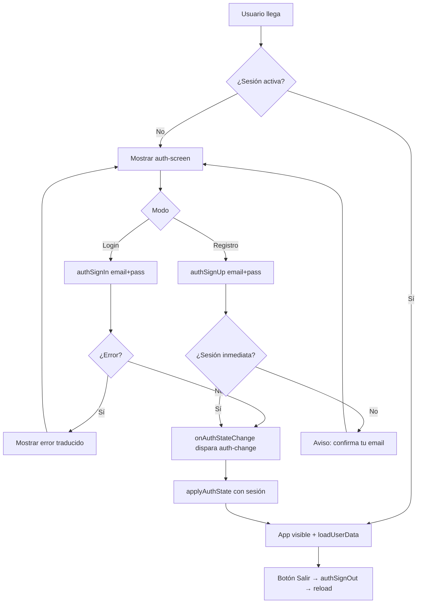
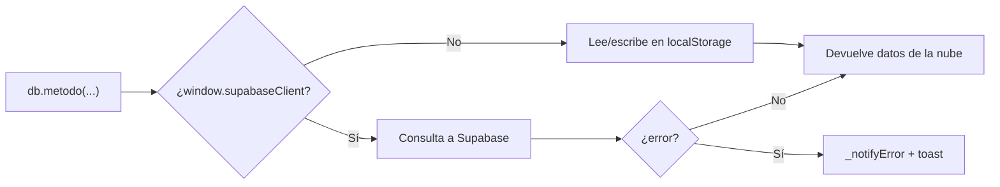
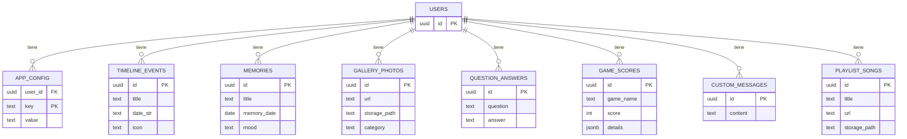
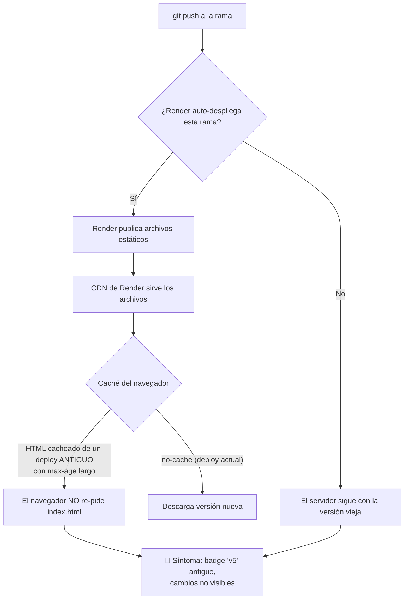
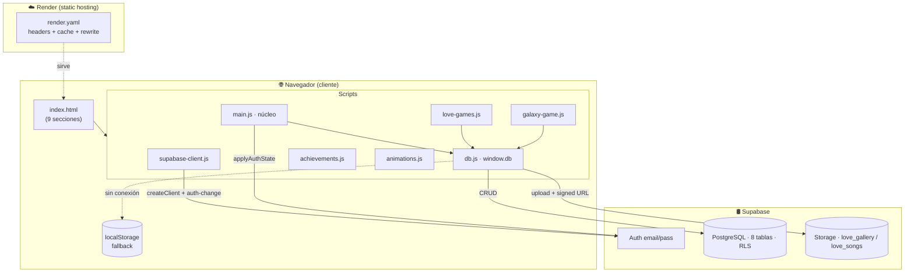

# 💛 Love Galaxy — Análisis Completo del Proyecto

> Documento técnico de revisión y análisis.
> Aplicación web romántica interactiva (regalo personal para "Tamara").
> Generado el 2026-06-07.

---

## 1. Resumen ejecutivo

**Love Galaxy** es una *single-page application* (SPA) estática, sin framework, escrita en **HTML + CSS + JavaScript "vanilla"**. Usa **Supabase** como backend (autenticación, base de datos PostgreSQL y almacenamiento de archivos) y se despliega como **sitio estático en Render**.

La app está protegida por un *gate* de login: hasta que el usuario no inicia sesión, no se cargan sus datos. Cada sección (historia, galería, recuerdos, juegos, mensajes, playlist…) lee y escribe contra Supabase con seguridad por fila (**RLS**), de modo que cada cuenta solo ve sus propios datos.

| Característica | Valor |
|---|---|
| Tipo | SPA estática multisección (scroll + anclas) |
| Frontend | HTML5, CSS3, JS ES6 (sin framework ni build) |
| Backend | Supabase (Auth + Postgres + Storage) |
| Librerías externas | GSAP + ScrollTrigger, YouTube IFrame API, supabase-js v2 |
| Hosting | Render (static site) |
| Persistencia | Supabase con *fallback* a `localStorage` |
| Idioma | Español |

---

## 2. Stack y dependencias



---

## 3. Mapa de archivos

### Scripts cargados (en orden, al final del `<body>`)

| # | Archivo | Tamaño | Rol |
|---|---|---|---|
| 1 | `supabase-client.js` | 6 KB | Inicializa el cliente Supabase y expone `authSignIn/Up/Out`. Emite el evento `auth-change`. |
| 2 | `db.js` | 26 KB | **Capa de datos** (`window.db`). CRUD de todas las tablas + Storage + *fallback* a `localStorage`. |
| 3 | `achievements.js` | 8 KB | Sistema de logros/medallas. |
| 4 | `animations.js` | 20 KB | Cursor personalizado, partículas en canvas, scroll-reveal. |
| 5 | `extras.js` | 24 KB | Funciones complementarias de UI/efectos. |
| 6 | `galaxy-game.js` | 24 KB | Mini-juego arcade "Galaxia del Amor" (canvas). |
| 7 | `dome-gallery.js` | 11 KB | Galería tipo cúpula 3D. |
| 8 | `main.js` | 87 KB | **Núcleo**: arranque, auth-gate, navegación, contadores, secciones, playlist YouTube, timeline, etc. |
| 9 | `love-games.js` | 19 KB | **Módulo de 6 juegos románticos** (memoria, razones, ruleta, piropos, test, pregunta). Autocontenido. |

### Otros archivos

| Archivo | Rol |
|---|---|
| `index.html` | Estructura única de la app (todas las secciones). |
| `styles.css` (66 KB) | Estilos base. |
| `mobile-styles.css` / `theme-minimal.css` | Responsive + tema pastel minimalista. |
| `supabase-setup.sql` | Esquema completo + RLS + buckets (script a ejecutar en Supabase). |
| `migrate_to_auth.sql`, `update_schema.sql`, `fix_permissions.sql` | Migraciones/parches SQL. |
| `render.yaml` | Configuración de despliegue en Render (headers, cache, rewrite SPA). |
| `particles.js`, `romantic-effects.js`, `audio-visualizer.js` | **Presentes pero NO referenciados** en `index.html` (código muerto). |
| `*.md`, `INSTRUCCIONES_RENDER.txt` | Documentación. |

> ⚠️ **Hallazgo:** `particles.js`, `romantic-effects.js` y `audio-visualizer.js` existen en el repo pero ningún `<script>` los carga. Son candidatos a eliminar o integrar.

---

## 4. Secciones de la aplicación

| Ancla | Sección | Fuente de datos |
|---|---|---|
| `#home` | Hero + contadores (días/horas/latidos juntos) | `app_config` (fecha de inicio) |
| `#timeline` | "Nuestra Historia" (eventos editables) | `timeline_events` |
| `#gallery` | Galería de fotos por categoría | `gallery_photos` + Storage `love_gallery` |
| `#memories` | "Libro de Recuerdos" | `memories` |
| `#games` | **Juegos del Amor** (7 juegos) | `game_scores`, `question_answers` |
| `#love-meter` | Amor-ómetro | local / efecto UI |
| `#messages` | Chat / mensajes de amor | `custom_messages` |
| `#poems` | Poemas cósmicos | estáticos en `main.js` |
| `#playlist` | Playlist (archivos + YouTube) | `playlist_songs` + Storage `love_songs` |

---

## 5. Flujo de arranque (boot)



**Punto clave:** los datos del usuario (`loadUserData()`) **solo** se cargan tras un `auth-change` con sesión válida. Si Supabase no responde en 4 s, se fuerza la pantalla de login con un aviso de error.

---

## 6. Flujo de autenticación (gate de acceso)



> 💡 **Recomendación del propio esquema:** para una "app de pareja", lo más simple es que ambos usen **una sola cuenta compartida** (mismo email/clave), así comparten los mismos recuerdos. Con cuentas distintas, cada una ve solo sus datos (por RLS).

---

## 7. Capa de datos (`db.js`)

`window.db` es un objeto con métodos `async` que siguen siempre el mismo patrón **"Supabase primero, `localStorage` como respaldo"**:



### Métodos principales por dominio

| Dominio | Métodos |
|---|---|
| Config | `getConfig`, `setConfig` |
| Timeline | `getTimelineEvents`, `saveTimelineEvent`, `updateTimelineEvent`, `deleteTimelineEvent` |
| Fotos | `getPhotos`, `savePhoto`, `deletePhoto`, `compressImage`, `_signedGalleryUrl` |
| Recuerdos | `getMemories`, `saveMemory`, `deleteMemory` |
| Juegos | `saveGameScore`, `getHighScore`, `getHighScores` |
| Preguntas | `saveQuestionAnswer`, `getQuestionAnswers` |
| Mensajes | `saveCustomMessage`, `getCustomMessages` |
| Playlist | `saveSong`, `getPlaylist`, `deleteSong` |

> Las imágenes se **comprimen en el cliente** (`compressImage`, máx 1200 px) antes de subirse, y las URLs de archivos privados se generan **firmadas** (`createSignedUrl`).

---

## 8. Modelo de datos (Supabase / PostgreSQL)

Las 8 tablas comparten el patrón: `id` (uuid) + `user_id` (= `auth.uid()`) + campos propios + `created_at`. **Todas con RLS activado** (cada usuario solo accede a sus filas).



### Storage (buckets privados)

| Bucket | Contenido | Límite | MIME permitidos |
|---|---|---|---|
| `love_gallery` | Fotos | 5 MB | jpeg, png, gif, webp |
| `love_songs` | Canciones | 10 MB | mpeg, mp3, wav |

Políticas: lectura/edición/borrado solo del **dueño** del objeto; subida para cualquier usuario autenticado.

---

## 9. Módulo de juegos (`love-games.js`)

Módulo **autocontenido**: crea su propio modal (`#lg-modal`) e inyecta sus propios estilos (prefijo `lg-`). No depende de `onclick` inline; se cablea por **delegación de eventos + enlace directo**.

```mermaid
flowchart TD
    U[Usuario toca un botón .btn-game] --> D{Lanzador blindado}
    D -- Captura en document --> L[launch key]
    D -- Listener directo en el botón --> L
    L --> G{games[key]}
    G -- memory --> M[Memoria del Amor 🃏]
    G -- reasons --> R[Razones para Amarte 💌]
    G -- roulette --> RU[Ruleta del Amor 🎡]
    G -- piropos --> P[Piropos para mi Diosa 🌹]
    G -- compat --> C[Test de Compatibilidad 💞]
    G -- question --> Q[Pregunta del Día ❓]
    G -- galaxy --> GX[startGalaxyLoveGame · galaxy-game.js]
    M & R & RU & P & C & Q --> MOD[openGame → modal #lg-modal .active]
    C --> SC[saveScore → db.saveGameScore]
    Q --> SA[db.saveQuestionAnswer]
```

| Juego | `data-game` | Persiste |
|---|---|---|
| Memoria del Amor | `memory` | puntuación |
| Razones para Amarte | `reasons` | — |
| Ruleta del Amor | `roulette` | — |
| Piropos para mi Diosa | `piropos` | — |
| Test de Compatibilidad | `compat` | puntuación |
| Pregunta del Día | `question` | respuesta |
| Galaxia del Amor | `galaxy` | récord (en `galaxy-game.js`) |

> ✅ **Verificado en pruebas headless (jsdom):** cargando todos los scripts y simulando clics, los 6 juegos abren su modal correctamente y `window.LoveGames` queda registrado. El lanzador es robusto (captura + enlace directo + reintentos).

---

## 10. Despliegue, caché y el problema observado

Este es el punto más relevante para los fallos reportados ("la página no se actualiza / los juegos no responden").



### Configuración actual de `render.yaml`
- **Headers `Cache-Control: no-cache, max-age=0, must-revalidate`** para `/*` → correcto (fuerza revalidación de aquí en adelante).
- **Cabeceras de seguridad** (CSP, X-Frame-Options, nosniff, Referrer-Policy) → bien.
- **Rewrite `/* → /index.html`** → fallback SPA; los archivos estáticos existentes se sirven primero, así que **no rompe la carga de JS**.
- **Versionado de assets** con `?v=N` en cada `<script>`/`<link>` → cache-busting manual.

### Causa raíz más probable del problema histórico
Un **deploy antiguo** sirvió `index.html` con una caché de larga duración. El navegador la fijó y **deja de re-pedir el HTML**, por lo que los `no-cache` nuevos no se aplican hasta limpiar la caché. Por eso la etiqueta seguía mostrando una versión vieja.

### Verificación / solución
1. Abrir la URL con un parámetro único (`?v=6`) o en **incógnito** → fuerza HTML fresco del servidor.
2. Si aun así no cambia → **Render no ha redeployado**: hacer *Manual Deploy → Clear build cache & deploy*.
3. La etiqueta de diagnóstico (abajo-izquierda) lee `window.LG_BUILD`; solo muestra el número correcto si el JS nuevo se ejecutó realmente.

---

## 11. Seguridad

| Aspecto | Estado | Nota |
|---|---|---|
| RLS por usuario | ✅ Activado en las 8 tablas | Cada cuenta solo ve sus filas. |
| Storage privado | ✅ Buckets `public=false` + URLs firmadas | — |
| Clave Supabase en cliente | ✅ Es la *publishable/anon key* | Es seguro exponerla **si** RLS está bien configurado (lo está). |
| Cabeceras HTTP | ✅ CSP, nosniff, X-Frame-Options, Referrer-Policy | Definidas en `render.yaml`. |
| Validación de subidas | ✅ Límite de tamaño + MIME en buckets | Más compresión en cliente. |

> La `anon key` pública **no es un secreto**: su seguridad depende de RLS, que aquí está correctamente aplicado. No hay credenciales sensibles expuestas.

---

## 12. Hallazgos y recomendaciones

### 🟢 Fortalezas
- Arquitectura simple y sin build: fácil de desplegar y mantener.
- Buen patrón de *fallback* Supabase → `localStorage` (funciona aun sin conexión).
- Seguridad sólida (RLS + storage privado + URLs firmadas + CSP).
- Módulo de juegos desacoplado y robusto.

### 🟡 Mejoras sugeridas (prioridad media)
1. **Eliminar código muerto:** `particles.js`, `romantic-effects.js`, `audio-visualizer.js` no se cargan.
2. **`main.js` es muy grande (87 KB)**: convendría dividirlo por dominios (auth, galería, playlist, timeline…).
3. **Caché:** mantener `no-cache` en HTML pero permitir caché larga **solo** para assets versionados (`?v=`), para mejorar velocidad sin perder frescura.
4. **Funciones duplicadas:** existen dos `deletePhoto(...)` y dos `getCategoryName(...)` en `main.js` (líneas 896/972 y 886/1054) — la segunda definición pisa a la primera. Conviene unificar.
5. Limpiar el `<div id="lg-build">` (diagnóstico) cuando el problema de despliegue esté confirmado como resuelto.

### 🔴 Acción pendiente (el problema reportado)
- Confirmar **qué rama despliega Render** y que el último deploy esté *Live*. Es la causa raíz más probable de que "los cambios no se vean".

---

## 13. Diagrama global de la arquitectura



---

*Fin del análisis.*
